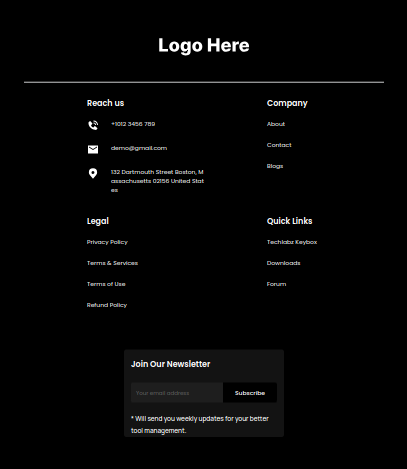

# This is an example Contact Us page using Next.js.

# Demo viewing -- https://contact-us-next-js.vercel.app/contact

Prerequisites
You will need Node.js version 8.0 or greater installed on your system.

## Getting Started

Setup
Get the code by either cloning this repository using git

Once downloaded, open the terminal in the project directory, and install dependencies with:

***npm install***

Then start the example app with:

***npm run dev***

The app should now be up and running at http://localhost:3000 

Open [http://localhost:3000](http://localhost:3000) with your browser to see the result.

## Learn More

To learn more about Next.js, take a look at the following resources:

- [Next.js Documentation](https://nextjs.org/docs) - learn about Next.js features and API.
- [Learn Next.js](https://nextjs.org/learn) - an interactive Next.js tutorial.

You can check out [the Next.js GitHub repository](https://github.com/vercel/next.js/) - your feedback and contributions are welcome!

## Deploy on Vercel

The easiest way to deploy your Next.js app is to use the [Vercel Platform](https://vercel.com/new?utm_medium=default-template&filter=next.js&utm_source=create-next-app&utm_campaign=create-next-app-readme) from the creators of Next.js.

Check out our [Next.js deployment documentation](https://nextjs.org/docs/deployment) for more details.

## A few examples

